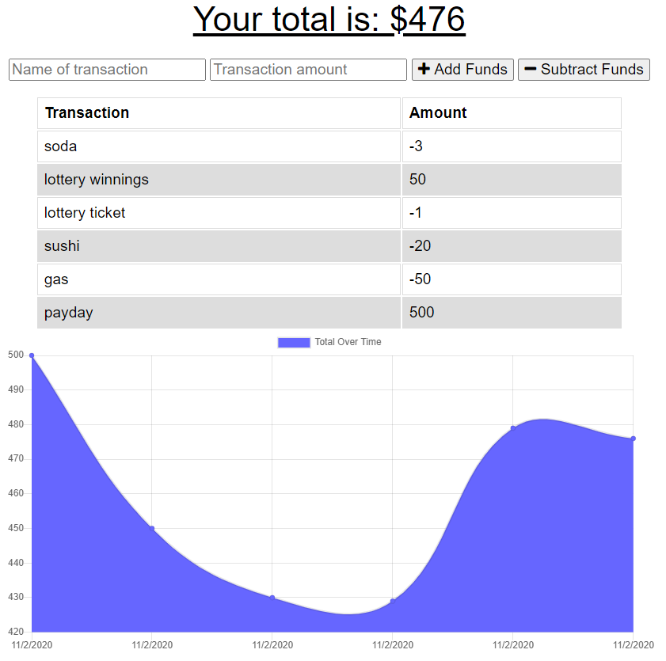
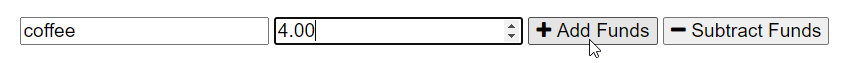
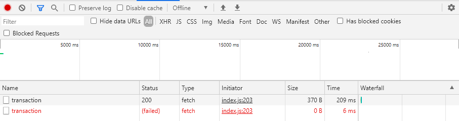
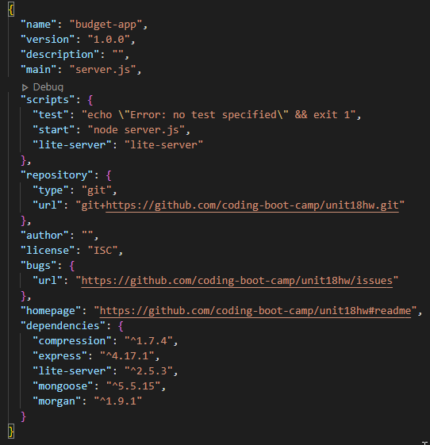

# offline_budget_tracker

## Authors: 
Alex Milroy  

## Table of contents:
* [Files](#Files)
* [Description](#Description)
* [Installation](#Installation)
* [Uses](#Uses)
* [License](#License)
* [Contributions](#Contributions)
* [Tests](#Tests)
* [Contact](#Contact)

## Files
* db.js
* index.html
* index.js
* manifest.webmanifest
* styles.css
* api.js
* package.json
* server.js

## Description
The offline budget tracker is a small application that tracks a users income and expenses, and displays them onscreen. The display includes a graph of income changes over time, and a list of all transactions including credits and debits from the users budget account. This app will help users more easily keep track of their budget and spending.

Example: https://secure-everglades-28471.herokuapp.com/

## Installation
To run locally, users must install all required NPM packages (compression, express, lite-server, mongoose, morgan). Users must also create a new database in Mongo. This will be done automatically as long as a mongo instance is running on your computer. This application starts in a terminal window. To run the application, open a new terminal window, and type “node server.js” to start the application. Then open a new browser window, and navigate to "localhost:3000" to see the application.

## Uses
Once the application is running, users can perform only a few actions. Upon first running the application, your balance will be zero. You can start by either adding funds, or subtracting funds. Users should input their current savings first to best utilize the app. They can then enter every transaction they make to keep track of their funds. As they enter each transaction, they can provide a name for that transaction, and the amount of that transaction by filling in the forms.

## License
This application is goverened by the MIT license.

## Contributions
Yes

## Tests
Users can test the application be ensuring its reachable at localhost:3000 after the database has been created, and a node server is running. Users can also test functions of the application by posting transactions to the application and ensuring that it records them correctly. Users can also test offline functionality by setting their browser to offline mode, posting transactions, and then returning their browser to online mode and checking their database to ensure the transactions posted.
    
## Contact:
github.com/ajm5099
amilroy@gmail.com

